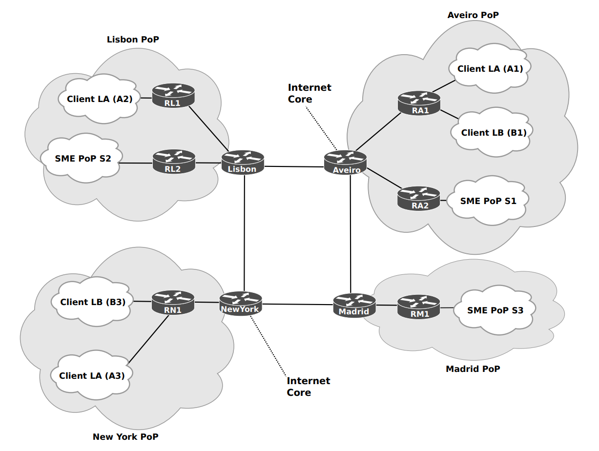

# AC Project

## Network

## IP subnetting

### Datacenters and Lo's

| Datacenter     |  Subnet Address/mask  |  Host Address Range     |  Broadcast Address |
|:--:|:--:|:--:|:--:|
| Lisbon RL1      |  10.0.0.0     /26    | 10.0.0.1   - 10.0.0.62    |   10.0.0.63    | 
| Lisbon RL2      |  10.0.0.64    /26    | 10.0.0.65  - 10.0.0.126   |   10.0.0.127   | 
| Aveiro RA1      |  10.0.0.128   /26    | 10.0.0.129 - 10.0.0.190   |   10.0.0.191   | 
| Aveiro RA2      |  10.0.0.192   /26    | 10.0.0.193 - 10.0.0.254   |   10.0.0.25    |
| Madrid RM1      |  10.0.1.0     /26    | 10.0.1.1 - 10.0.1.62      |   10.0.1.63    | 
| New York RN1    |  10.0.1.64    /26    | 10.0.1.65 - 10.0.1.126    |   10.0.1.127   | 
| Connections     |  10.0.1.128   /26    | 10.0.1.129 - 10.0.1.190   |   10.0.1.191   |  
| Lisboa-New York |  10.0.1.132   /30    | 10.0.1.133 - 10.0.1.134   |   10.0.1.135   |
| New York-Madrid |  10.0.1.136   /30    | 10.0.1.137 - 10.0.1.138   |   10.0.1.139   |
| Madrid-Aveiro   |  10.0.1.140   /30    | 10.0.1.141 - 10.0.1.142   |   10.0.1.143   |
| Aveiro-Lisboa   |  10.0.1.144   /30    | 10.0.1.145 - 10.0.1.146   |   10.0.1.147   |
| Connections     |  10.0.1.192   /26    | 10.0.1.193 - 10.0.1.254   |   10.0.1.255   |
| RL1 Lo0         |  10.0.1.148   /32    | - | - |
| RA1 Lo0         |  10.0.1.149   /32    | - | - |
| RN1 Lo0         |  10.0.1.150   /32    | - | - |
| RM1 Lo0         |  10.0.1.151   /32    | - | - |
| RL2 Lo0         |  10.0.1.152   /32    | - | - |
| RA2 Lo0         |  10.0.1.153   /32    | - | - |
| unassigned      |  10.0.1.154   /32    | - | - |
| unassigned      |  10.0.1.155   /32    | - | - |
| unassigned      |  10.0.1.156   /32    | - | - |
| unassigned      |  10.0.1.157   /32    | - | - |
| unassigned      |  10.0.1.158   /32    | - | - |
| unassigned      |  10.0.1.159   /32    | - | - |
| unassigned      |  10.0.1.160   /28    | 10.0.1.161 | 10.0.1.174 |    10.0.1.175     |
| unassigned      |  10.0.1.176   /28    | 10.0.1.177 | 10.0.1.190  |    10.0.1.191    |
| unassigned      |  10.0.1.192   /26    | 10.0.1.193 - 10.0.1.254 |    10.0.1.255     |